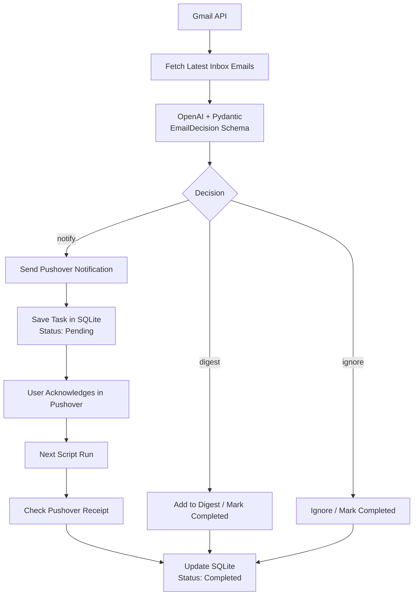

# SchoolCopilot 

An AI-powered assistant that helps parents manage school emails.

## Features

- Reads Gmail inbox emails
- Uses OpenAI structured outputs with Pydantic
- Categorizes emails by priority
- Sends urgent notifications using Pushover
- Tracks notification acknowledgements
- Stores processed emails in SQLite
- Prevents duplicate processing

## Tech Stack

- Python
- Gmail API
- OpenAI API
- Pydantic
- SQLite
- Pushover

## Architecture



## Setup

Clone the repository:

```bash
git clone <repo-url>
```

Install dependencies:

```bash
pip install -r requirements.txt
```

Create a `.env` file with:

```text
OPENAI_API_KEY=...
PUSHOVER_API_TOKEN=...
PUSHOVER_USER_KEY=...
```

Configure Gmail OAuth credentials:

credentials.json

Run:

```bash
python main.py
```

## Example Use Case

The project was built to help parents avoid missing important school emails by automatically prioritizing and notifying urgent items.
